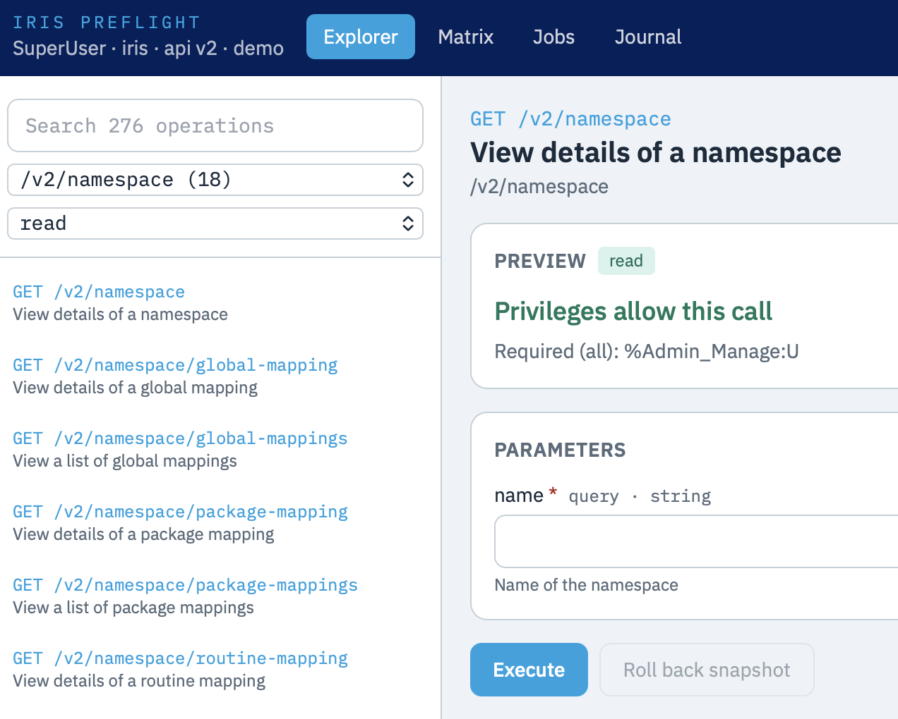

# IRIS Preflight

A privilege-aware execution console for the InterSystems IRIS [System Administration REST API](https://docs.intersystems.com/) (`/api/admin`, v2).

Preview a call against the connected user's `%Admin_*` privileges, execute it, journal the result, verify with a GET, and roll back from a pre-write snapshot when the path supports it.

**Live demo (no IRIS instance):** https://kvarnik.github.io/iris-preflight/



## Run with Docker

Requires [Docker](https://www.docker.com/). IRIS 2026.2 Community is pulled by the image.

```bash
docker compose up -d --build
```

Open http://localhost:52773/csp/preflight/index.html

Default credentials for the Community image: **SuperUser** / **SYS**.

The UI is a CSP-served React app. Credentials stay in a JavaScript closure for the tab and are sent only as an `Authorization` header. The default mode is read-only; enable writes in the header before mutating or destructive calls.

## What it does

- **Explorer** — 276 SysAdmin operations from the pinned OpenAPI spec, with privilege preview and role simulation
- **Matrix** — which `%Admin_*` resources you hold vs what each operation needs
- **Jobs** — poll 202 async tasks (cancel / pause / resume)
- **Journal** — session history plus snapshot/rollback for PUT/DELETE when a GET pair exists
- **Themes** — Classic InterSystems navy/cyan or dark mode

## Browser demo

The GitHub Pages build uses a local mock of `/api/admin`. Pick SuperUser, Operator, or Security on the login screen. Writes stay in the browser tab.

## Stack

- InterSystems IRIS Community 2026.2 (`intersystemsdc/iris-community:latest-cd`)
- ObjectScript installer and journal API (`Preflight.Installer`, `Preflight.REST`, `Preflight.Snapshot`)
- React + Vite + Tailwind frontend, built in Docker and served from `/csp/preflight/`

## License

MIT. See [LICENSE](LICENSE).
